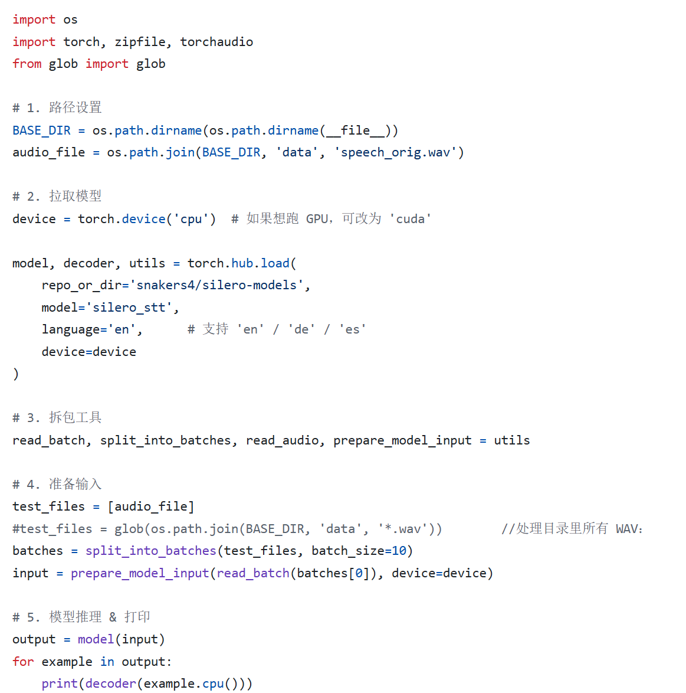
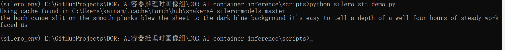
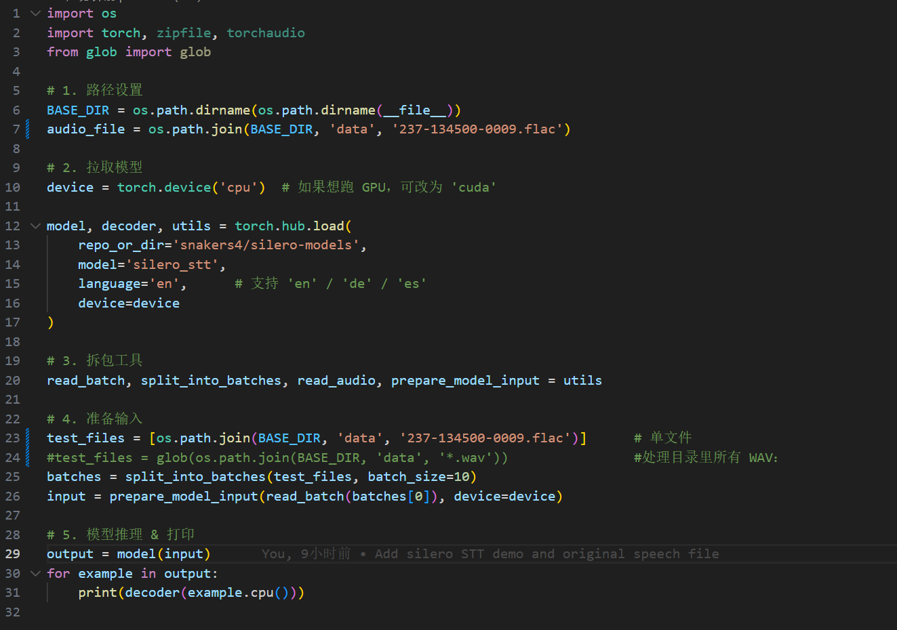
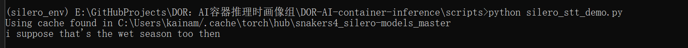

# silero_stt_实现示例1

## **Code(silero_stt_demo.py)**  using  audio(speech_orig.wav)

## **Result**   using  audio(speech_orig.wav)
     

# silero_stt_实现示例2

## **Code(silero_stt_demo.py)**  using  audio(237-134500-0009.flac)

## **Result**   using  audio(237-134500-0009.flac)

## 注意事項
- 运行时进入Script的目录下
- 